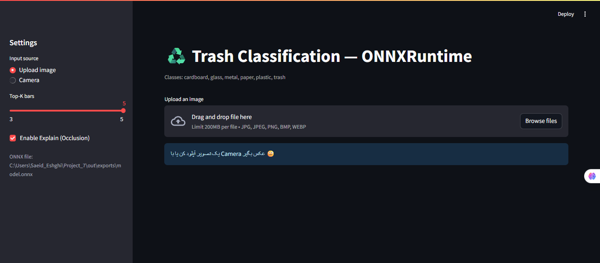
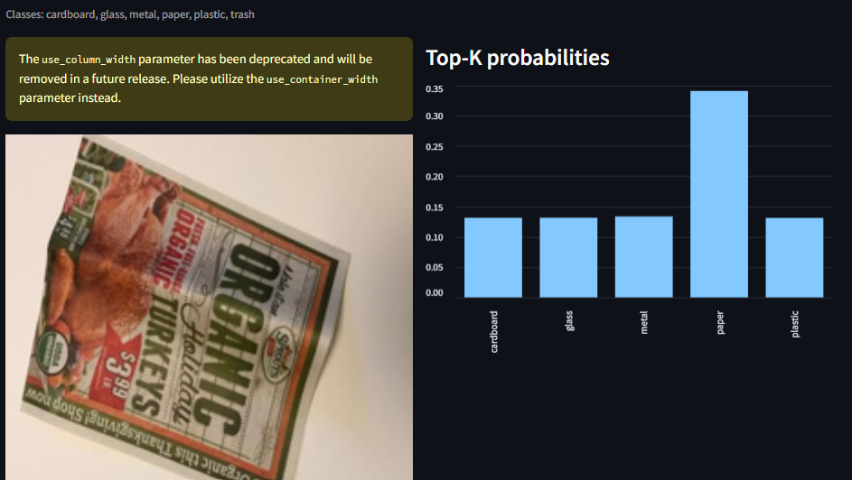
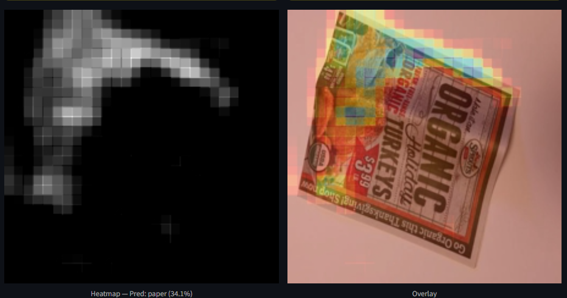

# ♻️ Trash Classification (6 Classes) — MobileNetV2 + ONNXRuntime 🚀

پروژهٔ تشخیص نوع زباله در ۶ کلاس: cardboard, glass, metal, paper, plastic, trash

A lightweight 6-class trash classifier with MobileNetV2 backbone. Train in Keras, deploy with ONNXRuntime + Streamlit for a clean, conflict-free UI.

# ✨ Key Features | ویژگی‌ها

Lightweight Transfer Learning: MobileNetV2 head-tuning + partial fine-tuning.

Class Imbalance Handling: weighted loss + balanced augmentation.

Two-Env Workflow: Train with TensorFlow (stable pins) → Export ONNX → Run UI with NumPy 2 (no TF conflicts).

Explainability: Occlusion Heatmap & overlay to visualize model attention.

Streamlit UI: Upload/Camera input, Top-K bars, Save frames for demos.

Reproducible Outputs: Reports (classification report JSON) under out/reports/.

# 📊 Sample Outputs | نمونه خروجی‌ها







# 🧠 Model & Training | مدل و آموزش

Backbone: MobileNetV2 (imagenet) → GlobalAvgPool → Dropout → Dense(6)

Image size: 224×224

Loss: SparseCategoricalCrossentropy (with class_weight)

Augmentations: random flip/rotate/zoom, color jitter (mild)

Metrics: Accuracy + sklearn.classification_report (per-class precision/recall/F1)

Training notebook: Untitled.ipynb (includes: dataset scan, tf.data pipelines, class weights, 2-stage training, eval report, occlusion explainability for Jupyter).

# 🏗 Project Structure | ساختار پروژه

```txt
.
├── app_onnx.py                 # Streamlit UI (ONNX runtime)  ← run this
├── Untitled.ipynb              # Training & evaluation notebook
├── out/
│   ├── checkpoints/            # best.keras (Keras model)
│   ├── exports/                # model.onnx (for UI)
│   ├── reports/                # classification_report.json
│   └── demo_frames/            # saved UI frames (for videos)
├── dataset/                    # 6 folders = 6 classes (cardboard/.../trash)
├── docs/                       # screenshots for README (optional)
├── classes.json                # ["cardboard","glass","metal","paper","plastic","trash"]
├── requirements-train.txt      # pinned for TF training
├── requirements-ui.txt         # pinned for ONNX + Streamlit UI
└── README.md

```
# ⚙️ Installation | نصب
## Option A — Training Env (TensorFlow, NumPy<2)

(برای آموزش و نوت‌بوک، بدون تداخل نسخه‌ها)

```txt
# requirements-train.txt
tensorflow==2.15.*
numpy==1.26.4
ml-dtypes==0.2.0
opencv-python-headless==4.10.0.84
matplotlib==3.8.4
pandas==2.2.2
scikit-learn==1.3.2
```
```txt
pip install -r requirements-train.txt
# run notebook
jupyter notebook Untitled.ipynb
```

## Option B — UI Env (ONNXRuntime + Streamlit, NumPy 2)

```txt
# requirements-ui.txt
numpy==2.0.2
onnxruntime==1.19.2
streamlit==1.40.1
pandas==2.2.2
pillow>=10.2
matplotlib==3.9.0
opencv-python-headless==4.10.0.84
```
```txt
pip install -r requirements-ui.txt
```
# ▶️ Run the App | اجرای رابط کاربری

مطمئن شو فایل‌های زیر وجود دارند:

out/exports/model.onnx

out/classes.json

سپس:
```txt
streamlit run app_onnx.py
```
Features in UI:

Upload/Camera input

Top-K probabilities

Occlusion Heatmap + Overlay

Save Frame → out/demo_frames/

# 🧩 Tech Stack | ابزارها

Training: TensorFlow/Keras, tf.data, scikit-learn

Deployment: ONNXRuntime (CPU), Streamlit UI

Explainability: Occlusion sensitivity map (gradient-free)

Utils: OpenCV, Pillow, Matplotlib, Pandas

# 📥 Dataset

TrashNet-style folder layout (single split with 6 class folders).

# 🧪 Reproduce | بازتولید

نصب requirements-train.txt → اجرای Untitled.ipynb

تولید best.keras → Export به out/exports/model.onnx

نصب requirements-ui.txt → اجرای streamlit run app_onnx.py

UI عمداً بدون TensorFlow است تا با NumPy 2 کاملاً پایدار باشد. (تبدیل به ONNX مشکل تداخل نسخه‌ها را حذف می‌کند.)
کد Streamlit UI اینجاست: app_onnx.py

# 📜 License

This project is licensed under the Apache-2.0 License.
